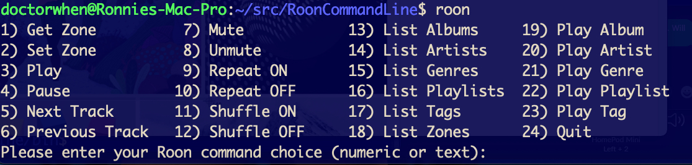
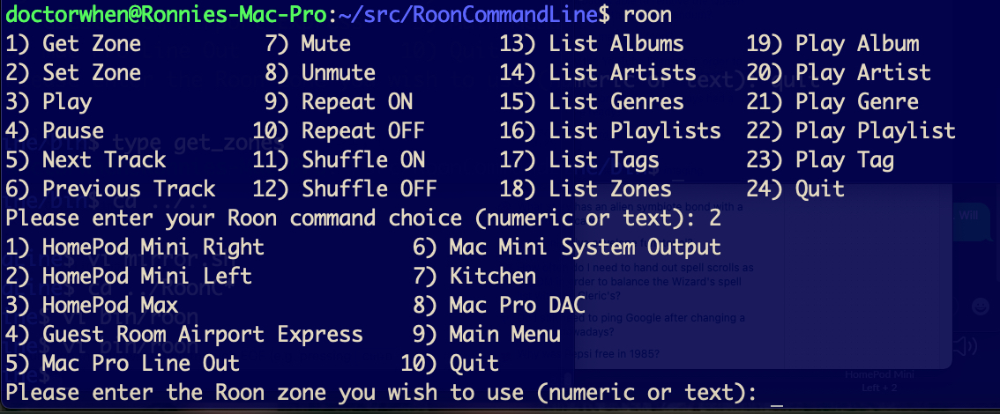

> **"The cosmic operating system uses a command line interface. It runs on
> something like a teletype, with lots of noise and heat; punched-out bits
> flutter down into its hopper like drifting stars. The demiurge sits at his
> teletype, pounding out one command line after another, specifying the values
> of fundamental constants of physics:**
>
> `universe -G 6.672e-11 -e 1.602e-19 -h 6.626e-34 -protonmass 1.673e-27`
>
> **and when he’s finished typing out the command line, his right pinky hesitates
> above the enter key for an aeon or two, wondering what’s going to happen;
> then down it comes—and the whack you hear is another Big Bang."**
>
> ― Neal Stephenson, In the Beginning...Was the Command Line

# RoonCommandLine

## Table of contents

1. [Overview](#overview)
1. [Requirements](#requirements)
1. [Installation](#installation)
    1. [Debian Package installation](#debian-package-installation)
    1. [RPM Package installation](#rpm-package-installation)
    1. [Mac OS X installation](#mac-os-x-installation)
    1. [Post installation configuration](#post-installation-configuration)
        1. [Zone groupings and defaults](#zone-groupings-and-defaults)
        1. [SSH public key authentication](#ssh-public-key-authentication)
    1. [Manual installation](#manual-installation)
1. [Remote deployment](#remote-deployment)
    1. [RoonCommandLine Light deployment](#rooncommandline-light-deployment)
1. [Removal](#removal)
1. [Screenshots](#screenshots)
1. [Troubleshooting](#troubleshooting)
1. [Usage](#usage)
1. [History and Motivation](#history-and-motivation)
    1. [Why would I need or want command line control of Roon](#why-would-i-need-or-want-command-line-control-of-roon)
1. [Contents](#contents)

## Overview

The Roon Command Line project provides Bash and Python scripts to enable
command line control of the Roon audio system over a local network.

**Note:** No modifications are made to the Roon Core. The RoonCommandLine
package resides entirely on other systems within your local area network.

Currently the command line Roon control scripts provide support for:
- Play album by album name
- Play artist name
- Play genre
- Play playlist by playlist name
- Play tag
- Play Roon Radio
- Issue one of the following commands in the specified zone
  - group
  - ungroup
  - play
  - pause
  - playpause
  - stop
  - next
  - previous
  - shuffle
  - unshuffle
  - repeat
  - unrepeat
  - mute
  - unmute
- List albums, artists, genres, playlists, tags, or Roon zones
- Set the default Roon output zone
- Select Roon audio zone or zone grouping

In addition, search capabilities have been added to the scripts
with partial matching facilities. Thus a substring can be supplied to use as a
search term with partial matching returning albums, artists, playlists, genres,
or tags which contain the specified substring (case sensitive). The special search
term "all" indicates match all albums, artists, playlists, genres, or tags.

All commands and playback can target a specified Roon output zone.

Additional detail and info can be found in the
[RoonCommandLine Wiki](https://gitlab.com/doctorfree/RoonCommandLine/-/wikis/home).

## Requirements

RoonCommandLine can be installed on either Linux or Mac OS X systems.
It requires a [Roon Core System](https://roonlabs.com/) reachable on the
local network, [Bash](https://en.wikipedia.org/wiki/Bash_(Unix_shell)),
[Python 3](https://www.python.org/), and the
[Python Roon API](https://github.com/pavoni/pyroon). The Python Roon API
will be installed as part of the RoonCommandLine installation process.

Ensure that a Roon Core System is running on the local area network and
Python 3 is installed on the Linux or Mac on which you wish to install
the RoonCommandLine package. Most modern Linux systems will have Python 3
already installed. A good guide for installing Python 3 on Mac OS X can
be found at https://docs.python-guide.org/starting/install3/osx/

## Installation

RoonCommandLine v2.0.0 and later can be installed on Linux systems using
either the Debian packaging format or the Red Hat Package Manager (RPM).
Support is also included for installing on Mac OS X. Other systems will
require a manual installation described below. The Mac OS X installation
procedure may also work under Microsoft's Windows Subsystem for Linux but
it is as yet untested.

### Debian Package installation

Many Linux distributions, most notably Ubuntu and its derivatives, use the
Debian packaging system.

To tell if a Linux system is Debian based it is usually sufficient to
check for the existence of the file `/etc/debian_version` and/or examine the
contents of the file `/etc/os-release`.

To install on a Debian based Linux system, download the latest Debian format
package from the
[RoonCommandLine Releases](https://gitlab.com/doctorfree/RoonCommandLine/-/releases).

Install the RoonCommandLine package by executing the command

```bash
sudo apt install ./RoonCommandLine_<version>-<release>.deb
```
or
```console
sudo dpkg -i ./RoonCommandLine_<version>-<release>.deb
```

### RPM Package installation

Red Hat Linux, SUSE Linux, and their derivatives use the RPM packaging
format. RPM based Linux distributions include Fedora, AlmaLinux, CentOS,
openSUSE, OpenMandriva, Mandrake Linux, Red Hat Linux, and Oracle Linux.

To install on an RPM based Linux system, download the latest RPM format
package from the
[RoonCommandLine Releases](https://gitlab.com/doctorfree/RoonCommandLine/-/releases).

Install the RoonCommandLine package by executing the command

```bash
sudo yum localinstall ./RoonCommandLine_<version>-<release>.rpm
```
or
```console
sudo rpm -i ./RoonCommandLine_<version>-<release>.rpm
```

### Mac OS X installation

RoonCommandLine requires Python 3. See the excellent
[Hitchhiker's Guide to Python](https://docs.python-guide.org/starting/install3/osx/)
for step by step instructions to install Python 3 on Mac OS X. If you already
have `Homebrew` installed on your Mac then you can install Python 3 with:

`brew install python`

Once the Python 3 dependency is met, install RoonCommandLine by
cloning the RoonCommandLine repository and executing the `Install` script:

```bash
    git clone `https://gitlab.com/doctorfree/RoonCommandLine.git`
    cd RoonCommandLine
    ./Install
```

**Note:** A cleaner installation can be accomplished by executing the `Install`
script as a user with `sudo` privileges and as the user which will be used
to SSH in to the system. If you are not going to enable SSH support, at least
make sure the user has sudo privileges.

### Post installation configuration

Default settings are applied during the installation process. The primary area
of post-installation configuration is setting the ZONEGROUPS and DEFAULT values
in the file `/usr/local/Roon/etc/roon_api.ini`. The RoonCommandLine installation
attempts to automate this configuration and should have provided a good starting
point with default settings in `roon_api.ini` but you may wish to adjust these.

#### Zone groupings and defaults

In Roon, you can view your existing zones by visiting `Settings->Audio`. The names
of the enabled audio devices are your zones. You can change the name of a zone by
clicking the "pencil" icon next to the name in the Roon audio settings screen.

Modify `roon_api.ini` with your desired zone groupings and default values.
In particular, set the `DefaultZone` value in the DEFAULT section to a zone
that will be available, enabled, and one you wish to use as your primary
default fallback zone. The installation picked a DefaultZone for you and
you may be satisfied with that automatic setting.

Note, the DefaultZone setting is used when no zone is specified,
RoonCommandLine commands all accept a `-z zone` argument that can be
used to specify the zone to be used as well as a `-G <group>` that can
be used to specify the zone grouping to use.

Note also that should you change the name of a Roon audio device in the future
then that name change will also need to be reflected in the `roon_api.ini` groupings.

#### SSH public key authentication

If you wish to enable remote exection of the RoonCommandLine tools then
it is necessary to setup SSH public key authentication. See the
[Troubleshooting section](#troubleshooting) below for tips on configuring
SSH public key authentication. The RoonCommandLine utilities can be
executed locally on the same system they are installed on by enabling
local access with the `roon -L` command. This avoids the need to enable
SSH public key authentication but restricts your use of the RoonCommandLine
tools to the system on which they are installed.

**Note:** The roon shell script is not passing credentials in the
SSH invocations. SSH authentication via public key needs to be enabled and
appropriate keys generated and propogated. This topic is addressed in various
guides on setting up SSH. Alternatively, the roon shell script can be
installed on the same system as the Python Roon API and backend scripts.
In this configuration, SSH is no longer required and the roon commands can
be executed locally. In order to enable local execution rather than remote
execution via SSH, run the command `roon -L`

**Another Note:** References in this document to SSH are not referring to
access to the Roon Core. Rather, the SSH facility can be used to remotely
access the system on which the RoonCommandLine tools are installed. All
communication and access to the Roon Core is accomplished via the Roon API.
No changes are ever made to the Roon Core nor is any access to the Roon
Core allowed other than via the API.

### Manual installation

There are three components to install. First, install the Python Roon API
on a system which is on the same local network as your Roon Core.

Note, verify you have Python 3 and pip already installed. For example,
on an Ubuntu 20.04 system I have installed, it was necessary to first configure
Python 3 as the default Python executable, install pip3, and then
configure pip3 as the default pip:

```bash
    $ sudo update-alternatives --install /usr/bin/python python /usr/bin/python3 10
    $ sudo apt install python3-pip
    $ sudo update-alternatives --install /usr/bin/pip pip /usr/bin/pip3 1
```

Once you have verified Python 3 and pip are installed appropriately, install
the Python Roon API:

```bash
    $ pip install roonapi
```

The second component is the Python Roon API frontend shell scripts
and the Python Roon API backend Python scripts. These both get installed on
the system on which the Python Roon API is installed. Copy this entire repository
to the target system. Change directory into the Roon subdirectory and execute
the "Install" script. This will copy the frontend shell scripts into
/usr/local/Roon/bin and the backend Python scripts into
/usr/local/Roon/api.

For example, on the system where the Python Roon API is installed:

```bash
    $ mkdir -p $HOME/src
    $ cd $HOME/src
    $ git clone git@gitlab.com:doctorfree/RoonCommandLine.git

    # Alternatively, download the latest release:
    # https://gitlab.com/doctorfree/RoonCommandLine/-/releases

    $ cd RoonCommandLine
    $ ./Install

    # Edit the Python Roon API command line configuration file.
    # Several default settings are provided. You may wish to modify these.
    $ vi /usr/local/Roon/etc/roon_api.ini

    # The RoonCoreIP setting should have been configured during install.
    # Verify the RoonCoreIP setting is correct.
    # If you do not know your Roon Core IP, run the discovery script
    $ /usr/local/Roon/bin/get_core_ip
    # Authorize the extension when prompted
    # In a Roon Remote client window click "Settings" -> "Extensions" -> "Enable"
```

The third component is the "roon" shell script and its configuration files.
These should be copied to a location in your shell execution PATH on all of
the systems from which you wish to issue command line Roon controls but chose
not to install the RoonCommandLine package there (see the section below on
[Remote deployment](#remote-deployment)).

    # The username and ip address of the Python Roon API server were
    # configured during installation. Verify these settings in the
    # roon script are correct.
    #
    # Copy the "roon" script to all systems on which you wish to use
    # the Python Roon API command line tools, every system you want to
    # enable as a command line Roon remote. Each system must be able to
    # access the Python Roon API installed system via SSH
    #
    # If you wish to run the roon front end script on the same system on
    # which the Python Roon API is installed, then execute the command
    # "roon -L" on that system. This will enable local execution of the
    # Roon Command Line scripts rather than remote execution via SSH.

## Remote deployment

Recommended deployment of the RoonCommandLine package is to install the
entire package on every system from which you wish to execute Roon control
commands. This deployment ensures you have all commands available without
the need to configure SSH public key authentication. If you install the
entire package on every system you wish to use for Roon command line control
then you can disregard the following instructions on "RoonCommandLine Light"
deployment.

### RoonCommandLine Light deployment

Not all systems satisfy the RoonCommandLine requirement of Python 3 and Pip.
On those systems that do not satisfy the Python/Pip requirement it is possible
to install just the `roon` command and RoonCommandLine configuration files.

After copying /usr/local/bin/roon and the /usr/local/Roon/etc/ directory
to the target system on which you wish to run Roon commands, perform the
following setup:

```bash
sudo mkdir -p /usr/local/bin
sudo cp roon /usr/local/bin/roon
sudo chmod 755 /usr/local/bin/roon
# Edit the `server` and `user` settings near the top of the script
sudo vi /usr/local/bin/roon
sudo mkdir /usr/local/Roon
sudo mkdir /usr/local/Roon/etc
sudo cp etc/pyroonconf /usr/local/Roon/etc/pyroonconf
sudo cp etc/roon_api.ini /usr/local/Roon/etc/roon_api.ini
# Make the RoonCommandLine configuration directory writeable by your user
USER=`id -u -n`
GROUP=`id -g -n`
sudo chown -R ${USER}:${GROUP} /usr/local/Roon/etc
sudo chmod 755 /usr/local/Roon/etc
sudo chmod 644 /usr/local/Roon/etc/*
```

**Note** A "RoonCommandLine Light" deployment of this nature not only requires
significant manual setup but will also require the configuration of SSH public
key authentication between the target system and a system on which the
RoonCommandLine package was installed. For this reason, it is recommended that
deployments install the entire package on every system, eliminating the need
for extensive manual configuration and SSH public key authentication.

## Removal

On Debian based Linux systems where the RoonCommandLine package was installed
using the RoonCommandLine Debian format package, remove the RoonCommandLine
package by executing the command:

```bash
    sudo apt remove rooncommandline
```
or
```bash
    sudo dpkg -r rooncommandline
```

On RPM based Linux systems where the RoonCommandLine package was installed
using the RoonCommandLine RPM format package, remove the RoonCommandLine
package by executing the command:

```bash
    sudo yum remove RoonCommandLine
```
or
```bash
    sudo rpm -e RoonCommandLine
```

On Mac OS X systems, the RoonCommandLine scripts, patches,
and configuration can be removed by executing the "Uninstall" script in the
RoonCommandLine source directory:

```bash
    git clone git@gitlab.com:doctorfree/RoonCommandLine.git
    cd RoonCommandLine
    ./Uninstall
```

## Screenshots

<p float="left">
Interactive menus when invoked with no arguments<br/>
  
  
</p>

## Troubleshooting

The most common difficulty encountered during initial setup of the Roon Command
Line package is the configuration of public key authentication in SSH. This allows
the "roon" command on your systems to execute Roon Command Line commands remotely
without the need to enter credentials. There are many guides available on the
Internet that provide instructions on configuring public key SSH authentication.
For instance, see
https://www.ssh.com/academy/ssh/command#configuring-public-key-authentication
or
https://serverpilot.io/docs/how-to-use-ssh-public-key-authentication/

Also, make sure the SSH service is running on the Python Roon API system.
Alternatively, install both the roon command and the Python Roon API on the
same system and run the roon commands locally, avoiding the need for SSH.
To enable local execution of the roon command line tools, issue the command:

    `roon -L`

In some cases the initial installation may fail to configure the system properly.
The Roon Command Line install creates two configuration files:

    `/usr/local/Roon/etc/pyroonconf`

and

    `/usr/local/Roon/etc/roon_api.ini`
    
These two configuration files are the first place to look when you encounter an issue.
The /usr/local/Roon/etc/pyroonconf file contains 3 settings:

    - The path to the Python User Base folder where the Python Roon API dist-packages
      directory is located
    - A variable used to determine if the Python Roon API patch has been applied
    - The currently active Roon Zone name used by the Roon Commmand Line

The /usr/local/Roon/etc/roon_api.ini file contains default values for
album name, artist, genre, playlist, tag, and zone as well as the name of a file
that contains a token used to authenticate with the Roon Core and the Roon Core IP
address. Verify the settings in roon_api.ini are valid and correct. The most common
issue will be an incorrect Roon Core IP address setting. You can verify this address
is correct by comparing it to the value displayed in your Roon Remote window at

    `Settings -> General`

under "ROON CORE".

Much of the Roon Command Line setup is automatically configured during the execution
of the ./Install script. If you have some expertise in Bash scripting you can
examine this script to see what commands were issued.

Another area that may be causing problems is the installation of the Python Roon API
package and its ability to communicate with your Roon Core. To debug problems I have
found it useful to SSH in to the system running the Python Roon API package and run
commands by hand there. For example, rather than running "roon -l zones" command
which remotely runs the list_zones command, SSH in as the configured user and run:

```bash
    cd /usr/local/Roon/api
    python list_zones.py -z all
```

This eliminates SSH and remote execution as well as the intermediate shell script
used to execute the python script. Similar python commands can be issued directly
on the Python Roon API system in the /usr/local/Roon/api directory.

The initial installation and configuration also includes a patch to the Python
Roon API site packages module installed prior to the Roon Command Line installation
with "pip install roonapi". This patch may fail to apply correctly. The application
of the patch requires that the patch command is installed on your system as well as
common commands like awk and sed. Check that these commands are properly installed
and, if not, install them.

The installation scripts use the command:

```bash
    $ python -c ‘import site; print(site.getsitepackages())’ | tr -d ‘[],’)
```

to retrieve a list of folders Python uses for site packages. If this command
fails to retrieve the Python site package folder that contains the
Python Roon API module, or if your Linux subsystem does not have the necessary
commands then the patch will fail. The patch is applied in the discovered folder,
and creates files with a .orig suffix as backups.

Verify that the "roon" frontend command shell script has been configured properly.
Open the roon shell script in an editor and find the two lines near the top of the
file that set the "server" and "user" shell variables. Verify that the "server"
variable is set to the correct IP address of the Python Roon API server and that
the "user" variable is set to the username used in the SSH commands to execute
the Python commands on the Python Roon API server. These should have been set for
you automatically during the installation process but may have been misconfigured.

## Usage

**Note:** The first time you execute the `roon` command you may have to enable
the Python Roon API extension by clicking "Settings" -> "Extensions" -> "Enable"
in a Roon Remote client window. On most systems this will not be necessary as
this was performed during initial installation.

The Python Roon API scripts must be installed on a system that is on the same
local network as the Roon Core. The `roon` shell script is the primary user
interface. It accepts a wide variety of arguments and sends a command to the
Python Roon API system which then communicates with the Roon Core.

If no arguments are provided to the `roon` command then an interactive dialog
is presented from which the user can select commands and queries. 

Here is the current output of "roon -u" which displays a usage message.

    Usage: roon -L -r -u
        -A album -a artist -g genre -G zone_group
        -l [albums|artists|genres|playlists|tags|zones]
        -s search -p playlist -t tag -z zone
        -c [group|ungroup|play|pause|stop|next|previous|shuffle|unshuffle|repeat|unrepeat|mute|unmute]

    Where:
        -A album selects an album to play
        -a artist selects an artist to play
        -g genre selects a genre to play
        -p playlist selects a playlist to play
        -G zone_group specifies a zone grouping specified in roon_api.ini
        -L setup roon to execute local commands rather than remote via SSH
        -l [albums|artists|genres|playlists|tags|zones] indicates list albums, artists, genres, playlists, tags, or Roon zones
        -s search specifies a term to search for in the lists retrieved with -l
            use the special search term "all" to indicate match all entries
        -r radio selects a live radio station to play
        -t tag selects an tag to play (not yet working)
        -z zone selects the Roon Zone in which to play
        -c [group|ungroup|play|pause|playpause|stop|next|previous|shuffle|unshuffle|repeat|unrepeat|mute|unmute]
            issues the command in the selected zone

    Example invocations
        Play artist:
            roon -a "Deep Purple"
        Play artist in specified zone:
            roon -a "Jethro Tull" -z "Mac Pro DAC"
        Play genre:
            roon -g Classical
        Play playlist:
            roon -p "Bowie Favs"
        Play next track:
            roon -c next
        Stop play in specified zone:
            roon -c stop -z Kitchen
        Mute a specified zone:
            roon -c mute -z "Mac Pro DAC"
        List all playlists containing the string 'Best':
            roon -l playlists -s Best
        Group the zones listed in roon_api.ini Group_foobar:
            roon -G foobar -c group
        NOTE: Use quotes to specify media names which contain spaces.
        For example, to play the album 'Love Bomb':
            roon -A "Love Bomb"

When playing media from the command line it is possible to specify a substring
with which a partial match can be made. In order to play media, either the full
name of the desired media or enough of a substring to uniquely match must be
supplied. This applies to playing an album, artist, genre, playlist, or tag.
For example, the command "roon -a Tull" would play media by artist "Jethro Tull"
unless there were multiple artist name matches to the substring "Tull". All partial
matching is case sensitive - "roon -a tull" would not match "Jethro Tull".

## History and Motivation

### Why would I need or want command line control of Roon

One might reasonably ask "Why would I need or want command line control
of my Roon audio system"? Truth be told, most Roon users do not need or
want command line control of Roon or any other software. They are happy
with the graphical user interfaces they use and never ever see a command
line prompt. So the answer to that question is almost always "You don't".

However, some users (mostly old propeller head codgers) are comfortable
at the command line and prefer to use it over the tedious mouse clicks
required to get anything done in a graphical user interface. Different
lanes for different brains.

I would say the most significant use case for command line control of anything
is automation. For example, if I want to schedule playback of specified music
in specific zones triggered by some event, then command line control can be
used to implement this. That can be done via Cron jobs, play something in some
zone at scheduled times. Or playback of specified songs in selected zones could
be triggered by some event like when a particular face is recognized by my smart
mirror or when my smart lights are turned to a particular profile. I use command
line control of Roon coupled with Apple Siri voice commands that trigger an SSH
shortcut to run the command. There are many use cases for automation using command
line utilities.

The other main use case for command line control is simple convenience.
If you spend a lot of time in a Shell environment then it is just easier
to type a command that plays what you would like to hear where you want
to hear it than it is to switch windows, bring up a GUI, click a few times
to find what you want, and click to play it, then go back to your terminal
window and Shell env. Most people do not live in a Shell environment like
I do so this use case is not that significant.

Finally, the command line interface and the associated Roon API can provide
capabilities not available in the Roon GUI. Searching, listing, and filtering
can be augmented by the plethora of tools available in a typical Shell
environment. You can pipe the output of a Roon command to grep, sed, awk,
and other standard utilities to produce results unavailable in the GUI.
That is, command line control along with the API and Shell utilities/builtins
can extend the capabilities of the Roon audio system. The RoonCommandLine
package also enables some features not easily available in the Roon GUI.
One of these, preconfigured Zone Grouping, allows the RoonCommandLine user
to easily and quickly switch between any of the preconfigured zone groupings
in `/usr/local/Roon/etc/roon_api.ini`. Yes, you can change the zone grouping
in Roon but it takes quite a few actions on the user's part to accomplish this.
In my household I find it frequently desirable to be able to switch zone
groupings easily and quickly and I can do so by configuring these presets to
my typical use cases.

### History

This project began as an attempt to control Roon with Siri voice commands.
Several users had posted in the Roon forums various ways to use Siri to control Roon.
These usually took the form of a fake device in HomeBridge that then communicates with
HomeKit and Siri. This seemed cool but maybe overkill. I was able to get Siri voice
control of Roon working with simple SSH shortcuts that execute Python scripts which
utilize the Roon API to control Roon.

Apple SSH shortcuts can be used to execute commands on systems that allow SSH access.
I used an Ubuntu 20.10 system recently installed to install the Python Roon API project
(pip install roonapi) and quickly cobbled together a Python script based on one of
the examples in that project. The Python script accepts an argument specifying an artist
name in my Roon library. It then uses the Roon API to play music from my library by
that artist in the specified zone.

On my iPhone I then created shortcuts which use the “Run script over SSH”
option for Apple Scripting shortcuts. The shortcuts execute a Bash command which is a
shell script that executes the Python script with appropriate arguments. It all seems
to work. I did run into a few gotchas. It seems with current Python/Pip installs you
need to specify an environment variable telling Python where the Pip modules are located.
So I needed a login shell to pick that up but I could not figure out how to tell the
Apple shortcut to give me an SSH login shell. The Python env variable is set in the
shell script the SSH session executes.

Currently this project has morphed primarily into a set of command line tools to control
various aspects of Roon remotely. There is still the capability to augment this command
line control with Siri voice commands that trigger an Apple Shortcut which executes a
command via SSH. But what we have here in the repository are the command line tools.

RoonCommandLine v2.0.0 introduced Debian and RPM format package installation
accompanied with extensive automated configuration. In most environments, deployment
of this package will require little to no manual configuration.

## Contents

[**roon**](bin/roon) - Shell script frontend that provides the primary user
interface to communicate commands via the Python Roon API. Recommended usage
is to issue Roon commands and queries via the `roon` frontend rather than
executing the following commands directly.

[**clone_pyroon**](bin/clone_pyroon) - Shell script to retrieve the pyroon project source code from Github and apply my patches

[**get_core_ip**](bin/get_core_ip) - Shell script to retrieve the Roon Core IP address

[**play_album**](bin/play_album) - Shell script frontend for playing a specified album in my Roon library

[**play_artist**](bin/play_artist) - Shell script frontend for playing a specified artist in my Roon library

[**play_genre**](bin/play_genre) - Shell script frontend to play a specified genre

[**play_playlist**](bin/play_playlist) - Shell script frontend to play a specified playlist

[**play_radio**](bin/play_radio) - Shell script frontend for playing Live Radio in a Roon zone

[**play_tag**](bin/play_tag) - Shell script frontend to play a specified tag

[**list_albums**](bin/list_albums) - Search and list the available Albums in your Roon Library

[**list_artists**](bin/list_artists) - Search and list the available Artists in your Roon Library

[**list_genres**](bin/list_genres) - Search and list the available Genres in your Roon Library

[**list_playlists**](bin/list_playlists) - Search and list the available Roon Playlists

[**list_radio**](bin/list_radio) - Search and list the available Roon Live Radio Stations

[**list_tags**](bin/list_tags) - Search and list the available Roon Library tags

[**list_zones**](bin/list_zones) - List the available Roon Zones

[**set_zone**](bin/set_zone) - Set the Roon Zone in which subsequent commands will run

[**set_zone_group**](bin/set_zone_group) - Set one of the Roon Zone groupings specified in roon_api.ini

[**zone_command**](bin/zone_command) - Shell script frontend for commands to be issued in the selected Roon Zone (e.g. play, pause, mute, unmute, next track, previous track)

[**LICENSE**](LICENSE) - Apache License version 2.0

[**NOTICE**](NOTICE) - Copyright notice

[**Install**](Install) - Installation script for Linux systems, Debian format install

[**Uninstall**](Uninstall) - Removal script for Linux systems, Debian format uninstall

[**macInstall**](macInstall) - Installation script for Mac OS

[**macUninstall**](macUninstall) - Removal script for Mac OS

[**usage.txt**](usage.txt) - Frontend "roon" script usage documentation

[**api/**](api/README.md) - Python scripts to call the Roon API with appropriate arguments

[**patches/**](patches/README.md) - Patches to the Python Roon API to extend its capabilities
